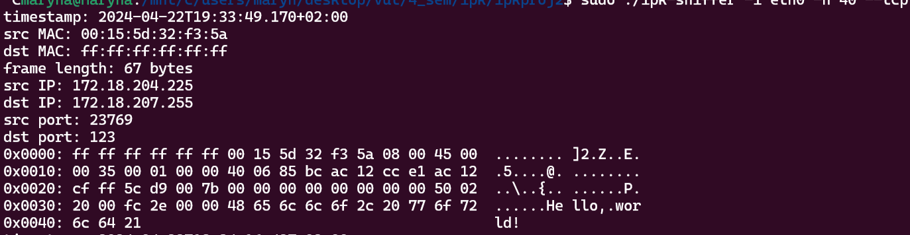

# IPK24 - Project 2 - ZETA: Network sniffer
This project's task was to implement a network analyzer that will be able to capture and filter packets on a specific network interface

## Content
1. [Program arguments](#1)
2. [Implementation](#2)
3. [Testing](#3)
4. [Resourses](#4)

##  Program arguments

Program supports this types of arguments:
- `-i/--interface` : network interface. If this parameter is not specified (and any other parameters as well), or if only `-i` is specified without a value (and any other parameters are unspecified), a list of active interfaces is printed.
- `-t/--tcp` : display TCP packets.
- `-u/--udp` :  display UDP packets.
- `-p` : extends previous two parameters to filter TCP/UDP based on port number.
- `--port-destination` : extends previous two parameters to filter TCP/UDP based on port destination number.
- `--port-source` : extends previous two parameters to filter TCP/UDP based on port source number.
- `--icmp4` : display ICMPv4 packets.
- `--icmp6` : display ICMPv6 echo request/response.
- `--arp` : display ARP frames.
- `--ndp` : display NDP packets, subset of ICMPv6.
- `--igmp` : display IGMP packets.
- `--mld` : display MLD packets, subset of ICMPv6.
- `-n` : specifies the number of packets to display, default `-n 1`.

##  Implementation

The implementation of the program consists of two parts.

The first part is contained in the file Arguments.cpp, where a class is implemented for processing command-line arguments and populating variables for packet filtering. All arguments are processed in the constructor of the class using if-else constructs, but TCP, UDP, and port-related arguments are handled separately to ensure they are processed together when filtering.

The second part of the project is implemented in the file ipk-sniffer.cpp. It includes the main processes of packet capture, filtering, and printing data from the packets. Besides the main function and the main packet processing function packetHandler, there is an auxiliary function for printing MAC addresses `print_MAC`, packet data in byte format `printBytes` and signalHandler.

##  Testing

The program was tested using a Python script that created packets of different types, and the program output was compared with the captured packets in Wireshark.

Program output.

Wireshark.

##  Sources
1. [Tcpdumb. PROGRAMMING WITH PCAP](https://www.tcpdump.org/pcap.html)
2. [Tcpdumb. PCAP-FILTER](https://www.tcpdump.org/manpages/pcap-filter.7.html)
3. [Wikipedia. ICMPv6 types](https://en.wikipedia.org/wiki/ICMPv6)
4. [Wikipedia. List of IP protocol numbers](https://en.wikipedia.org/wiki/List_of_IP_protocol_numbers)